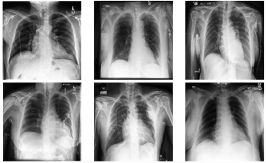
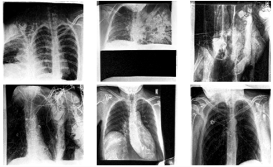
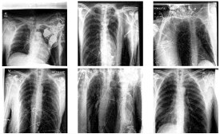
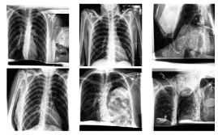
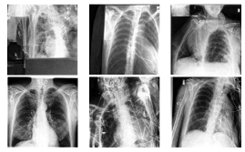

# Chest X-ray Generation with DDPM and Score-Based Models

This repository contains the code used to implement and compare a **Denoising Diffusion Probabilistic Model (DDPM)**, a **Noise Conditional Score Network (NCSN)**, and an **extended NCSN** for unconditional chest X-ray generation using the CheXpert dataset.

The project focused on X-rays labelled **“No Finding”** and compared the models using generated samples, **Fréchet Inception Distance (FID)**, and **Fréchet Radiomics Distance (FRD)**.

## Dataset and experimental setup
This project uses the CheXpert small dataset. The code expects `data_loc` to point to the directory containing: ```CheXpert-v1.0-small/train.csv```. CheXpert data are not included in this repository and must be obtained separately.

- 15,000 chest X-ray images from CheXpert, all labeled "No Finding" (no reported pathologies)
- First 13,000 images used for model training, with the training data shuffled during training
- Remaining 2,000 images held out as a test set
- Test set randomly split into two disjoint sets of 1,000 images each for model evaluation and a real-vs-real baseline
- Image size: 128 × 128
- Training: 100 epochs, batch size 16, learning rate `1e-4`

## Models

| Model | Main configuration | Parameters |
|---|---|---:|
| DDPM | U-Net, `T = 1000` diffusion steps | 22,596,929 |
| NCSN | Same U-Net as DDPM, 50 noise levels, annealed Langevin dynamics, EMA copy | 22,596,929 |
| Extended NCSN | Deeper U-Net with additional channels and self-attention layer, EMA copy | 70,675,137 |

Using the same U-Net for DDPM and the original NCSN keeps the architecture fixed when comparing the two generative approaches. The extended NCSN was introduced as a separate architectural experiment to improve global anatomical consistency.

## Results

Each model variant was used to generate 1,000 images from pure noise. FID and FRD were calculated against a held-out set of 1,000 real images. A second disjoint set of 1,000 real images was used for the real-vs-real baseline. FRDv1 was calculated with use_paper_log=True. All generated images were retained for evaluation (no cherry-picking).

| Comparison | FID | FRD |
|---|---:|---:|
| Real vs. real baseline | 20.40 | 1.30 |
| DDPM vs. real | **33.92** | **2.19** |
| NCSN vs. real | 121.28 | 3.65 |
| NCSN-EMA vs. real | 106.23 | 3.30 |
| Extended NCSN vs. real | 108.27 | 3.53 |
| Extended NCSN-EMA vs. real | 78.65 | 2.74 |

Among the generated-image sets, DDPM produced the lowest FID and FRD. EMA improved the NCSN results, and the extended NCSN with EMA further reduced both metrics relative to the original NCSN.

### Representative generated samples

**DDPM**



**NCSN**



**NCSN with EMA**



**Extended NCSN**



**Extended NCSN with EMA**




## Environments

Training/generation and FID/FRD evaluation were performed in two separate environments.

| Purpose | Python | Important packages |
|---|---|---|
| Model training and generation | 3.9.12 | PyTorch 1.13.0, torchvision 0.14.0, MONAI 0.5.0, NumPy 1.26.2 |
| FID/FRD evaluation | 3.10.13 | PyTorch 2.1.2, torchvision 0.16.2, torchmetrics 1.5.2, torch-fidelity 0.3.0, frd-score 1.0.1, NumPy 1.26.4 |

The `requirements-lock-*.txt` files are snapshots of the original Conda/container environments. These files are retained for environmental records. The shorter `requirements-training.txt` and `requirements-evaluation.txt` files contain the main portable dependencies used in this project.

The old MONAI version is intentional: the training code was developed with MONAI 0.5.0, which includes APIs that have since changed or been removed.

## Running the code

Configure the CheXpert path and output paths in the corresponding scripts.

Run commands from the repository root.

### 1. Train a model

```bash
python -m ddpm.train
python -m ncsn.train
python -m extended_ncsn.train
```

### 2. Generate images

```bash
python -m ddpm.generate_images
python -m ncsn.generate_images
python -m extended_ncsn.generate_images
```

### 3. Calculate FID and FRD

Use the evaluation environment, edit the image paths/settings in `calculate_metrics/calculate_fid_frd.py`, then run:

```bash
python -m calculate_metrics.calculate_fid_frd.py
```

The evaluation script compares generated sets with held-out real images and can additionally calculate the real-vs-real baseline.


## Attribution

The DDPM implementation was initially adapted from an existing [**DeepFinder**](https://deepfindr.github.io/) implementation ([Colab Notebook](https://colab.research.google.com/drive/1sjy9odlSSy0RBVgMTgP7s99NXsqglsUL?usp=sharing)) and then modified for this project. 

## Notes

This repository is intended as a research implementation and project record rather than a medical imaging production repository. Generated images are synthetic outputs and are not intended for clinical use.
